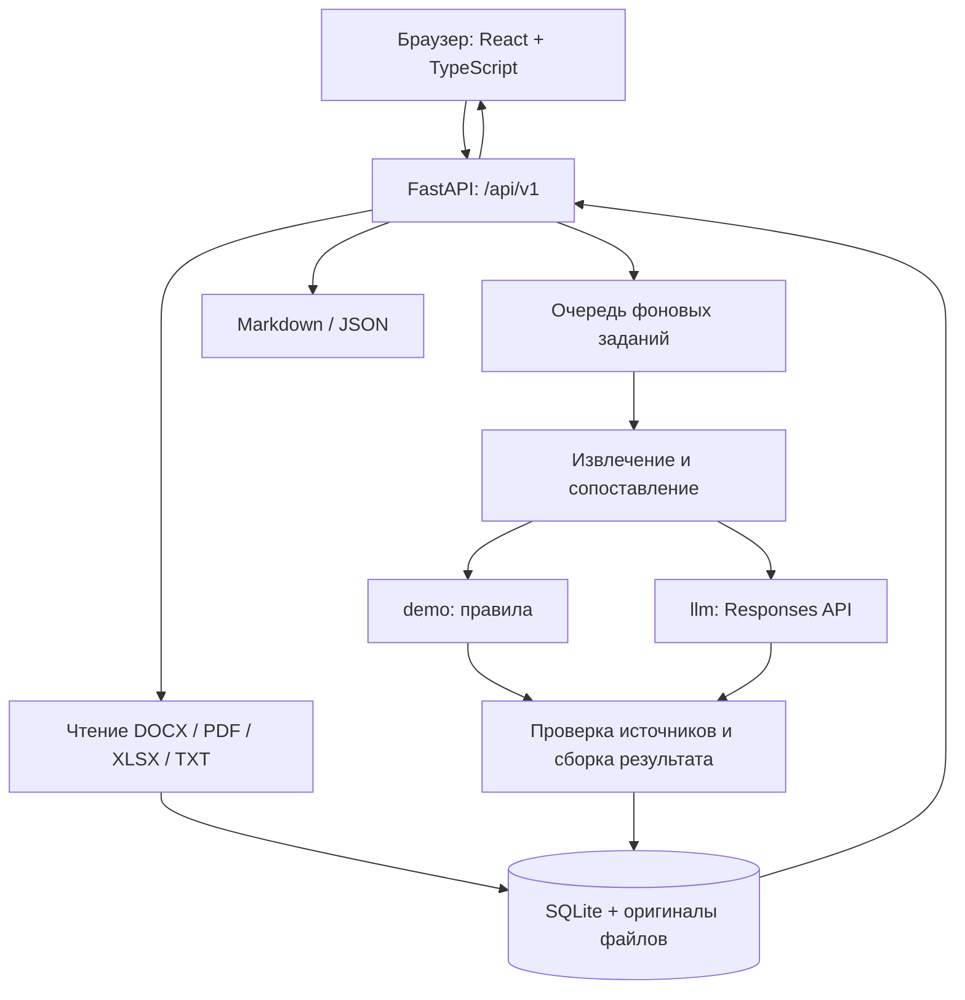

# Larpsec — анализ изменений организационной структуры и функций

**Larpsec** — веб-приложение для HackAlem, которое сравнивает комплекты организационных
документов **до и после изменений**: положения о подразделениях, должностные инструкции
и перечни функций. Результат — сопоставление подразделений и полномочий, замечания
и цитаты, по которым сотрудник может проверить каждый вывод.

При реорганизации обязанность может исчезнуть из документов, перейти другому подразделению
или оказаться одновременно у нескольких владельцев. Larpsec помогает сотрудникам
внутреннего аудита, организационного развития и кадровых служб проверять такие изменения.
Приложение анализирует **описанное в документах распределение функций**; фактическое
исполнение обязанностей оно не проверяет.

В текущем прототипе есть два режима: **`demo` — анализ по правилам без ИИ** и
**`llm` — извлечение и сопоставление с помощью модели через Responses API**.
Учебный сценарий можно воспроизвести без ключа модели.

## 1. Что реализовано

| Возможность | Что получает пользователь |
| --- | --- |
| Комплекты «до» и «после» | Загрузка нескольких DOCX, PDF, XLSX или TXT в одно сравнение |
| Извлечение текста | Текст с адресами источников: пунктами, абзацами, страницами, листами и ячейками — в зависимости от формата |
| Текстовое сравнение | Две колонки, подсветка изменений по словам, отдельные счётчики добавленных, удалённых и изменённых строк |
| Анализ структуры | Подразделения, должности, группы и их сопоставления между версиями, включая переименования |
| Анализ функций | Обязанности, права, запреты и область действия; сохранённые, переданные, изменённые, добавленные и несопоставленные функции |
| Замечания | Возможная потеря функции, дублирование, противоречие, изменение подчинения и недостаточное покрытие анализа |
| Проверка источников | Цитаты с переходом к исходному фрагменту и подсветкой соответствующего текста |
| Проверка сотрудником | Подтверждение или отклонение замечания, сохранение комментария; фильтры по типу и статусу проверки |
| Повторы текста | Поиск повторяющихся формулировок внутри документов, выбор версии и переход к источникам |
| История | Открытие предыдущих сравнений и удаление сравнения вместе с его файлами, результатами и оценками |
| Темы интерфейса | Переключение светлой и тёмной темы с сохранением выбора в браузере |
| Экспорт | Русскоязычный Markdown-отчёт и JSON с метаданными документов, исходными фрагментами и адресами цитат |

Полнота комплектов задаётся пользователем отдельно для каждой стороны. Ограничения
извлечения показываются предупреждениями и влияют на покрытие анализа. Если структура
не распознана, результат сообщает об этом; извлечённый текст остаётся доступен для сравнения.
Повтор формулировки сам по себе не считается доказательством дублирования полномочий.

## 2. Как работает решение

1. **Создайте сравнение.** Загрузите документы в комплекты «до изменений» и «после изменений».
2. **Проверьте извлечённый текст.** Сервер проверит формат файлов, сохранит оригиналы,
   извлечёт текст и покажет предупреждения. Текстовое сравнение доступно до запуска анализа функций.
3. **Укажите полноту комплектов.** Отмечайте комплект полным, только если загрузили все необходимые документы.
4. **Запустите сравнение.** Сервер в фоне извлечёт владельцев и функции, сопоставит версии
   и проверит ссылки на исходные фрагменты. Браузер опрашивает состояние задания.
5. **Изучите результат.** Просмотрите изменения подразделений и функций, замечания,
   смену подчинения и подтверждающие цитаты.
6. **Зафиксируйте решение.** Подтвердите или отклоните замечания, добавьте комментарии,
   скачайте отчёт. Результаты сохраняются на сервере и доступны в истории.

### Где используется ИИ

| Режим | Как выполняется анализ | Что требуется |
| --- | --- | --- |
| `demo` | Правила распознают обозначения владельцев, заголовки, списки функций, прежние названия, виды полномочий и подчинение. Сопоставляются нормализованные формулировки | Только локальное приложение; обращения к модели отсутствуют |
| `llm` | Модель извлекает структуру из порций текста, затем сопоставляет извлечённые элементы двух комплектов и предлагает замечания | Ключ, доступная модель и endpoint с поддержкой Responses API и strict JSON Schema |

В режиме `llm` сервер проверяет структуру ответа, идентификаторы, принадлежность
элементов нужной версии и наличие дословных цитат. Итоговые статусы и числовая сводка
формируются сервером. Проверка цитаты подтверждает её наличие в документе, но не гарантирует
правильность смыслового вывода — для этого предусмотрена проверка сотрудником.

Текстовый дифф выполняется алгоритмом в браузере. Чтение файлов, хранение, проверка
доказательств и экспорт также реализованы кодом приложения. Ошибка модели не подменяется
демонстрационным результатом.

## 3. Технологии

| Компонент | Технологии |
| --- | --- |
| Интерфейс | TypeScript 5.9, React 19, Vite 7, CSS, Lucide React; Mammoth для локального просмотра DOCX |
| Сервер | Python 3.12–3.14, FastAPI, Uvicorn, Pydantic и pydantic-settings |
| Чтение документов | python-docx, pypdf, openpyxl; обработка TXT на Python |
| Хранение | SQLite и локальная файловая система |
| AI-интеграция | HTTP-клиент httpx, OpenAI Responses API, структурированные ответы по JSON Schema |
| Фоновые задания | ThreadPoolExecutor в процессе сервера |
| Проверки | pytest, Ruff, Vitest, Playwright; ReportLab для тестовых PDF |
| Установка и сборка | uv, pnpm 10.30.3, Docker Compose |

Конкретная AI-модель **не зафиксирована в исходном коде**: её идентификатор задаётся
через `LLM_MODEL`. По умолчанию endpoint — `https://api.openai.com/v1`, а режим — `demo`.
Зависимости зафиксированы в [backend/uv.lock](backend/uv.lock)
и [frontend/pnpm-lock.yaml](frontend/pnpm-lock.yaml).

## 4. Архитектура проекта



После сборки FastAPI раздаёт `frontend/dist`, поэтому сайт и API работают на одном
адресе. В режиме разработки Vite запускается отдельно и проксирует запросы к серверу.
Текстовый дифф и поиск повторов используют извлечённый текст на стороне клиента.

```text
.
├── run.sh                     # Сборка интерфейса и запуск приложения
├── compose.yaml               # Запуск в Docker с постоянным томом данных
├── backend/
│   ├── app/
│   │   ├── main.py            # HTTP API, доступ и раздача интерфейса
│   │   ├── parsing.py         # Чтение файлов и адресация фрагментов
│   │   ├── analysis.py        # Оркестрация анализа и вычисление результатов
│   │   ├── demo.py / llm.py   # Два режима анализа
│   │   ├── evidence.py        # Проверка цитат и ссылок
│   │   ├── jobs.py / store.py # Фоновые задания и хранение
│   │   └── report.py          # Экспорт отчётов
│   ├── scripts/               # Генерация примеров, API-демо, экспорт OpenAPI
│   └── tests/                 # Серверные и регрессионные тесты
├── frontend/
│   ├── src/                   # Страницы, API-клиент и текстовое сравнение
│   ├── public/examples/       # Учебная пара DOCX для интерфейса
│   └── tests/                 # Модульные и браузерные тесты
├── examples/scenario.json     # Синтетические данные и ожидаемые изменения
└── docs/                      # Архитектура, API, схема и результаты проверок
```

Подробнее: [архитектура](docs/ARCHITECTURE.md), [контракт API](docs/API.md),
[OpenAPI](docs/openapi.json), [пример результата](docs/example-result.json).

## 5. Установка и запуск

### Вариант A: локальный запуск

Необходимы **Git**, **Node.js 22.12+ с npm/npx**, **Python 3.12–3.14** и **uv**.
Команды рассчитаны на Linux/macOS; на Windows используйте WSL или Docker.
Для приватного репозитория нужен доступ на GitHub.

**1. Получите проект** либо перейдите в уже существующую копию:

```bash
git clone git@github.com:BAITC-Hacks/hack-85aebd11-larpsec.git
cd hack-85aebd11-larpsec
```

**2. Запустите воспроизводимый режим без модели:**

```bash
ANALYSIS_MODE=demo ./run.sh
```

Скрипт устанавливает зависимости по lock-файлам, собирает интерфейс и запускает сервер.
Глобальная установка pnpm не нужна: используется версия из `package.json` через npx.
Первый запуск требует доступа к реестрам зависимостей. Локальный `.env` скрипт не перезаписывает.

**3. Откройте приложение:**

- Сайт: **http://127.0.0.1:8000**.
- Состояние сервера: http://127.0.0.1:8000/health.
- Swagger UI: http://127.0.0.1:8000/docs, если не включена защита токеном.

Для запуска с настройками из `backend/.env` используйте `./run.sh` без переопределения
`ANALYSIS_MODE`. Другой порт: `PORT=8001 ./run.sh`. Остановка — `Ctrl+C`;
база и загруженные документы сохраняются между запусками.

### Настройка AI-анализа

Если `backend/.env` ещё нет, создайте его из шаблона:

```bash
cp -n backend/.env.example backend/.env
```

Заполните значения в локальном файле:

```dotenv
ANALYSIS_MODE=llm
LLM_API_KEY=YOUR_API_KEY
LLM_MODEL=YOUR_MODEL_ID
LLM_BASE_URL=https://api.openai.com/v1
```

Замените `YOUR_API_KEY` и `YOUR_MODEL_ID` своими значениями и перезапустите приложение
командой `./run.sh`. Модель должна поддерживать **Responses API и strict JSON Schema**.
Сервис, поддерживающий только Chat Completions, не подходит для существующего адаптера.

`LLM_API_KEY` хранится только на сервере; `.env` исключён из Git. Переменные `VITE_*`
попадают в браузерную сборку, поэтому секреты в них размещать нельзя.
В режиме `llm` текст документов передаётся провайдеру, а запросы оплачиваются по его тарифам.

Дополнительные настройки находятся в [backend/.env.example](backend/.env.example)
и [backend/app/config.py](backend/app/config.py): лимиты, таймауты, каталог данных,
число фоновых заданий и общий токен приложения.

### Вариант B: Docker Compose

Из корня репозитория:

```bash
docker compose up --build
```

Нужен Docker Compose с поддержкой необязательного `env_file` (`required: false`).
Node.js, Python и uv на хосте не требуются: сборка выполняется внутри контейнера.
Сайт доступен на **http://127.0.0.1:8000**; настройки читаются из `backend/.env`, если файл
существует. Без него используется `demo`. Данные сохраняются в томе `analysis_data`.
Порт опубликован только на localhost. Docker-сценарий присутствует в репозитории,
но его запуск не подтверждён в [отчёте проверки](docs/VALIDATION.md).

### Разработка интерфейса

Первый терминал, корень репозитория:

```bash
./backend/run.sh
```

Второй терминал, корень репозитория:

```bash
cd frontend
npx --yes pnpm@10.30.3 install --frozen-lockfile
npx --yes pnpm@10.30.3 dev
```

Интерфейс откроется на **http://127.0.0.1:5173**; `/api` и `/health` проксируются на порт 8000.
Подробности подключения: [frontend/README.md](frontend/README.md).

## 6. Как проверить решение: сценарий для жюри

### Через интерфейс

Для повторяемого результата запустите сервер с `ANALYSIS_MODE=demo` по инструкции выше.

1. Откройте сайт. Если уже есть сравнение, нажмите **«Новое сравнение»**.
2. Нажмите **«Загрузить пример „до/после“»**. Учебная пара DOCX будет загружена на сервер.
3. Откройте **«Сравнить текст»**, выберите документы обеих версий и посмотрите подсветку изменений.
4. Проверьте, что оба учебных комплекта отмечены полными, затем нажмите **«Запустить сравнение»**.
5. После завершения откройте результаты. В учебном сценарии предусмотрены следующие изменения:

| Что проверить | Ожидаемый результат |
| --- | --- |
| Департамент непрерывного мониторинга → Департамент непрерывного аудита | Переименование подразделения |
| «Готовит отчёт о результатах непрерывного аудита» | Передача функции в департамент контроля качества аудита и методологии |
| «Проверяет сохранность активов» | Возможная потеря функции |
| «Проверяет права доступа к информационным системам» | Возможное дублирование у разных владельцев |
| Утверждение платежей поставщикам при сохранённом запрете | Противоречие полномочий |
| Отдел аналитики | Создание подразделения |

6. В замечании откройте **«Источники»** и проверьте цитату в документе.
7. Подтвердите или отклоните замечание, добавьте комментарий и перезагрузите страницу:
   решение должно сохраниться.
8. Скачайте **отчёт Markdown** и **JSON**. Откройте сравнение через **«История»**;
   ненужное завершённое сравнение можно удалить вместе с его файлами.

Двойное функциональное/административное подчинение и одинаковые действия в разных
областях включены как контрольные случаи без нарушения. Исходные тексты и ожидаемые
изменения находятся в [examples/scenario.json](examples/scenario.json).
Это синтетические данные; результат вычисляется при запуске анализа.

### Через API

При работающем сервере откройте второй терминал в корне репозитория:

```bash
cd backend
uv run --frozen --no-dev python -m scripts.demo_client
```

Скрипт создаёт учебные документы, новое сравнение, загружает оба файла, запускает анализ
и сохраняет результат в `backend/data/demo/result.json`, отчёт — в
`backend/data/demo/report.md`. Он использует текущий режим сервера: при `llm` будут
выполнены обращения к модели. Если включён `API_TOKEN`, передайте его скрипту
одноимённой переменной окружения.

Для генерации только учебных DOCX/XLSX, без запросов к серверу, из каталога `backend`:

```bash
uv run --frozen --no-dev python -m scripts.make_demo
```

### Автоматические проверки

Из корня репозитория — серверные тесты, линтер и экспорт схемы:

```bash
cd backend
uv sync --frozen --group dev
uv run --frozen pytest -q
uv run --frozen ruff check .
uv run --frozen python -m scripts.export_openapi
```

В другом терминале, из корня репозитория — интерфейс и браузерные сценарии:

```bash
cd frontend
npx --yes pnpm@10.30.3 install --frozen-lockfile
npx --yes pnpm@10.30.3 test
npx --yes pnpm@10.30.3 build
npx --yes pnpm@10.30.3 exec playwright install chromium firefox
npx --yes pnpm@10.30.3 test:e2e
npx --yes pnpm@10.30.3 test:api
```

В [docs/VALIDATION.md](docs/VALIDATION.md) за 23 сентября 2026 года зафиксированы:
**217 серверных, 71 модульный тест интерфейса, 33 браузерных сценария и 5 сценариев
восстановления API**; Ruff и сборка также прошли. Браузерные проверки используют
отдельный сервер в режиме `demo` и временную БД. Автотесты модельного адаптера работают
с тестовым HTTP-провайдером и не подтверждают качество анализа живой моделью.

## 7. Данные и интеграции

### Входные данные

| Формат | Что читается и как адресуется источник |
| --- | --- |
| DOCX | Абзацы, таблицы, колонтитулы, номера списков; ссылки на разделы, абзацы и пункты |
| PDF | Текстовый слой, объединение переносов; ссылки на страницы и фрагменты |
| XLSX | Листы и значения ячеек, таблицы с распознаваемыми заголовками владельца и функции; ссылки на лист и диапазон |
| TXT | Строки текста; UTF-8, UTF-16/UTF-32 с BOM, Windows-1251 с предупреждением |

Источники анализа — загруженные пользователем файлы. Учебные данные хранятся в
`examples/scenario.json` и `frontend/public/examples/`. Подключённых справочников
законодательства, внешних корпоративных систем или баз для сравнения организаций нет.

### Хранение и доступ

- При обычном локальном запуске SQLite находится в `backend/data/analysis.sqlite3`,
  оригиналы — в `backend/data/uploads/`. Корень хранения меняется через `DATA_DIR`.
- В БД сохраняются метаданные, SHA-256 файлов, фрагменты, состояние анализа, результаты
  и решения проверяющего. Данные не исчезают при перезагрузке страницы.
- Удаление сравнения очищает связанные записи и оригиналы. Удалять задания в очереди
  или в процессе анализа нельзя.
- Необязательный `API_TOKEN` защищает API и `/docs`, `/redoc`, `/openapi.json`.
  На сайте он вводится в **«Доступ к серверу» → «Токен доступа»** и сохраняется в
  `sessionStorage` текущей вкладки. Это отдельный токен приложения, не ключ модели.
- `/health` и статические файлы интерфейса доступны без токена.

### Внешний API

В режиме `llm` сервер отправляет извлечённые фрагменты и структурированные данные в
настроенный Responses API. В запросе указано `store: false`; это не обещание полного
отсутствия хранения данных у провайдера. Модели не предоставляются инструменты,
доступ к shell или поиск в интернете. В режиме `demo` внешний AI-сервис не используется.

## 8. Ограничения текущей версии

- **Качество выводов.** `demo` ограничен правилами и не гарантирует распознавание свободных
  перефразирований, неявных слияний и разделений. Сложные конфликты между должностью
  и подразделением через подразумеваемые связи полномочий в этом режиме не реализованы.
  Выводы `llm` также требуют проверки человеком; измерений точности на реальном корпусе
  в репозитории нет.
- **Качество входных файлов.** OCR, чтение графических оргструктур, старые бинарные
  DOC/XLS и вычисление формул Excel не реализованы. Изображения, непринятые исправления
  Word и неоднозначные таблицы могут снизить полноту извлечения. Внешний вид страницы
  Word или PDF в текстовом сравнении не воспроизводится.
- **Полнота.** Отметка «все документы загружены» не гарантирует полноту извлечения.
  При обнаруженных ограничениях сервис сообщает о недостаточном покрытии; отсутствие
  замечаний не является доказательством отсутствия организационных проблем.
- **Доступ и масштабирование.** Прототип рассчитан на одну доверенную команду: отдельных
  аккаунтов и разграничения доступа между пользователями нет. Сервер запускается одним
  процессом (`--workers 1`); очередь локальная, без распределённых обработчиков.
- **Прерывание работы.** После аварийного завершения незавершённый анализ помечается
  ошибкой и требует повторного запуска. Продолжения с последнего обработанного фрагмента нет.
  Ранее завершённые сравнения после изменения кода автоматически не пересчитываются.
- **Внешние нормы.** Проверка законодательства и сравнение с другими организациями не реализованы.

Основные лимиты по умолчанию заданы в [конфигурации](backend/app/config.py):

| Ограничение | Значение |
| --- | --- |
| Документов в сравнении | 20 суммарно для двух сторон |
| Размер одного файла | 20 МБ |
| Извлечённых символов в одном документе | 200 000 |
| Извлечённых символов в сравнении | 400 000 |
| Извлечённых функций | 1000 на каждую сторону |
| Сериализованный вход одного запроса к модели | 300 000 символов |
| Таймаут HTTP-запроса к модели | 120 секунд |
| Параллельных фоновых заданий | 2 |

Лимиты настраиваются переменными окружения. Символы не равны токенам: ограничения
контекста выбранной модели действуют дополнительно. Анализ больших документов включает
несколько запросов; процент прогресса обновляется по этапам и документам, поэтому
не отражает продвижение каждого отдельного запроса.

## 9. Развёрнутая версия

**Публичная ссылка на развёрнутое приложение в репозитории не указана.**
Подтверждённый способ демонстрации — локальный запуск по инструкции выше:
**http://127.0.0.1:8000**. Это адрес приложения на вашем компьютере.
Для развёртывания подготовлены [Dockerfile](backend/Dockerfile)
и [compose.yaml](compose.yaml); конкретный облачный хостинг не настроен в репозитории.
