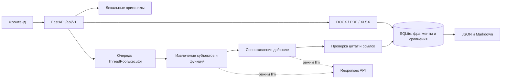

# Архитектура бэкенда

## Модули

- `app/main.py`: HTTP-контракт, токен команды, CORS, ограничение размера запроса.
- `app/parsing.py`: извлечение текста и стабильных адресов исходных фрагментов.
- `app/store.py`: SQLite, транзакции, фиксация комплекта, результаты и проверки сотрудника.
- `app/jobs.py`: фоновое выполнение, ограниченная очередь, восстановление после перезапуска.
- `app/analysis.py`: оркестрация извлечения, проверок, графа преобразований и заключения.
- `app/llm.py`: Responses API, JSON Schema, таймауты, ошибки и версии промптов.
- `app/demo.py`: отдельный воспроизводимый алгоритм для демонстрации без модели.
- `app/evidence.py`: проверка цитат и идентификаторы элементов.
- `app/report.py`: отчёт с источниками и человеческими оценками.

## Хранение и выполнение

Оригиналы получают случайные имена в `DATA_DIR/uploads`; исходные имена хранятся в БД.
SHA-256 используется для обнаружения повторной загрузки в один комплект. Метаданные,
текстовые фрагменты, состояние сравнения и результат переживают перезапуск процесса.

Каждое изменение состояния выполняется в транзакции SQLite. Начало анализа фиксирует
комплект: параллельная загрузка не может добавить документ после постановки в очередь.
Повторный запуск активного или завершённого задания идемпотентен. SQLite работает в WAL.

Это **однопроцессный прототип для доверенной команды**. `worker.lock` запрещает запуск
двух серверов с одним каталогом данных. Используйте `uvicorn --workers 1`; число параллельных
заданий задаётся `JOB_WORKERS`. При штатном завершении текущие задания завершаются.
После аварийного завершения незавершённые задания помечаются failed и могут быть
запущены пользователем снова. Очередь не является распределённой и не обеспечивает
продолжение с последнего шага. Путь масштабирования: отдельные worker-процессы,
надёжная очередь, PostgreSQL, объектное хранилище и пользовательская авторизация.

## Анализ

В режиме `llm` каждый документ разбивается на ограниченные порции текста. Модель получает
исходные фрагменты, известные названия субъектов и контекст предыдущих фрагментов.
Извлечение сохраняет обязанности, права, запреты, область действия и вид подчинения.
Для сравнения модель получает извлечённые элементы обоих комплектов и процитированные
источники. Большие комплекты не обрезаются молча: превышение лимита приводит к явной ошибке.
Лимит сериализованного запроса модели — 300000 символов (`MAX_LLM_INPUT_CHARS`).
Он учитывает повторение цитат в структурированных данных и настраивается под контекст
выбранной модели; символы не равны токенам, поэтому ограничения провайдера также действуют.

Модель формирует связи подразделений, связи функций и кандидатов на дублирование/конфликт.
Сервер проверяет существование идентификаторов, сторону до/после, дословность цитат,
полное цитирование первичного доказательства действия каждого участника связи и
несовместимость типов вроде «обязанность = запрет». Общий заголовок подразделения
не заменяет цитату действия функции.
Связи подразделений образуют граф: его компоненты определяют переименование, слияние,
разделение или более сложное преобразование. Несопоставленные исходные функции получают
статус potential_loss только при подтверждённой полноте обоих комплектов и отсутствии
обнаруженных ограничений извлечения, включая флаг неполноты, возвращённый моделью.
Иначе это coverage_gap/unmatched.

Проверка цитат доказывает наличие текста, но не гарантирует правильность смыслового
вывода модели. Полнота извлечения также не гарантируется. Поэтому замечания остаются
рекомендательными, всегда показываются источники и предусмотрена проверка сотрудником.
Числа в итоговом заключении вычисляются сервером; модель не сочиняет отдельные показатели.

В режиме `demo` работают консервативные правила для явно обозначенных владельцев и
буквального совпадения функций с учётом области и отрицания. Это не семантический ИИ.
Переименования определяются по явно указанному прежнему названию; свободные перефразирования,
неявные слияния, разделения и сложные конфликты требуют режима llm и проверки качества.

## Документы и ограничения

- Word: `.docx`, основной текст, таблицы, колонтитулы; адрес — абзац/пункт, без выдуманных страниц.
- PDF: текстовый слой и номера страниц; OCR не выполняется. Страницы без достаточного текста
  и страницы с изображениями отмечаются как потенциальная неполнота, даже если колонтитул
  распознан. Этот консервативный подход также может отметить страницу с логотипом.
  Полностью нечитаемый PDF отклоняется.
- Excel: `.xlsx`, текст ячеек, листы и диапазоны; формулы не вычисляются.
- Рисунки, вложенные объекты, непринятые исправления Word и формулы Excel вызывают
  предупреждения об ограничениях. Графическую оргструктуру нужно предоставить также текстом.
- Старые бинарные `.doc`/`.xls` требуется предварительно сохранить как DOCX/XLSX.
- Комплект ограничен числом файлов/символов/функций. По умолчанию: 20 файлов,
  20 МБ на файл, 200000 символов на документ, 400000 на сравнение, 400 функций.
- Внешние нормативы и бенчмаркинг не входят в текущую реализацию.

## Модель и данные

`ANALYSIS_MODE=llm` передаёт извлечённый текст и цитаты настроенному провайдеру модели.
`LLM_API_KEY` и `LLM_MODEL` обязательны. Endpoint должен поддерживать Responses API
и strict JSON Schema; произвольный Chat Completions-only сервер не совместим.
В запросе задаётся `store: false`. Это не обещание отсутствия всех журналов на стороне
провайдера: правила его хранения данных следует учитывать отдельно.

Текст документов передаётся как пользовательские данные; системный промпт запрещает
исполнять содержащиеся в них инструкции. Инструменты, shell и сетевой поиск модели
не предоставляются. Ключи и тела ошибок провайдера не возвращаются клиенту и не логируются.
Для HTTP 429/5xx выполняется до двух повторов. Таймауты, отказы и неполные ответы дают
ошибку задания без подмены результатов демонстрационным режимом.

Реализация REST-запросов опирается на [официальное описание Structured Outputs](https://developers.openai.com/api/docs/guides/structured-outputs).
Ограничения извлечения PDF описаны в [документации pypdf](https://pypdf.readthedocs.io/en/stable/user/extract-text.html).
